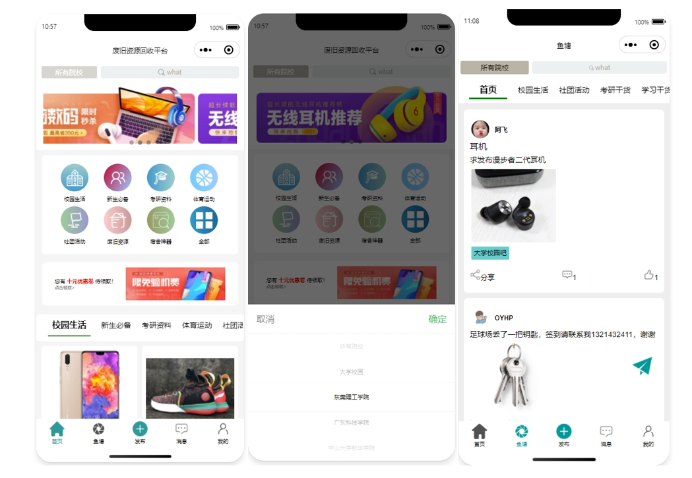

# 1.项目介绍
- 系统角色：管理员、普通用户
- 功能模块：管理员（商品管理、分类管理、用户管理、订单管理、院校管理等）、普通用户（发布商品、下架商品、购买商品、订单管理、消息模块、充值等）
- 技术栈：SpringBoot，layui，原生微信小程序
- 测试环境:idea2024，mysql5.7，maven3，navicat，jdk1.8等
# 2.项目部署
## 2.1 后端
- 创建数据库，导入sql
- 通过idea打开项目esyu_springboot，根据本地数据库环境配置src/main/resources/application-dev.properties  2-5行
- 注册一个微信小程序，或者申请小程序测试号也可以，配置src/main/java/com/oyhp/esyu/util/WXUtil.java  28-29行
- 启动项目
- 管理web：http://localhost:8080/esyu_springboot 账号密码：admin、admin，或查看admin表
## 2.2 小程序
- 通过微信开发工具打开项目esyu-u
- appid按照实际的配置
- 打开项目，信任运行，编译即可
- 授权登录
# 3.项目部分截图

# 4.获取方式
[戳我查看](https://gitee.com/aven999/mall)